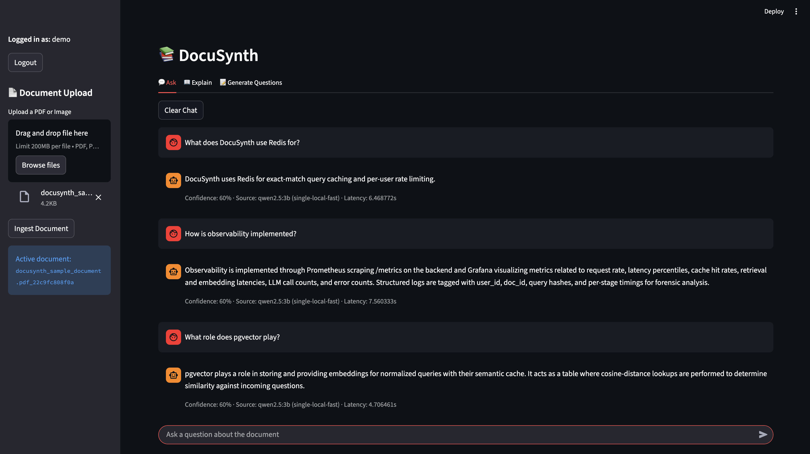
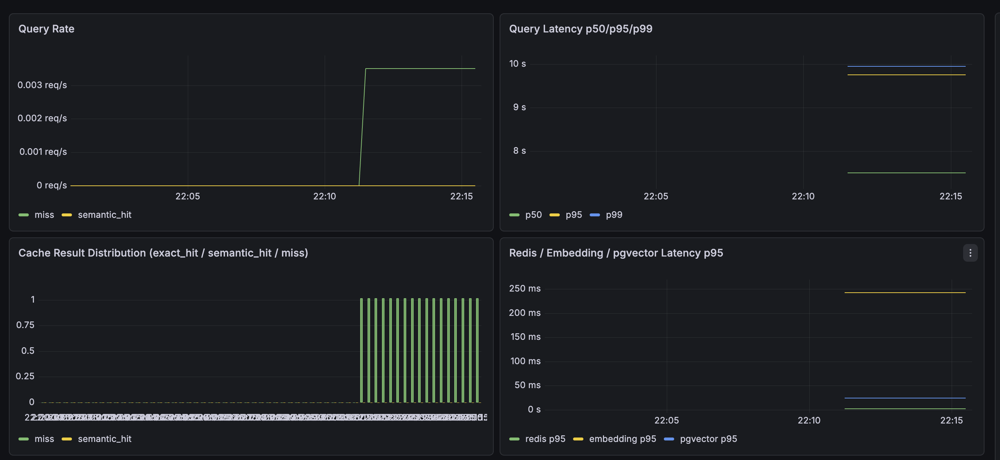
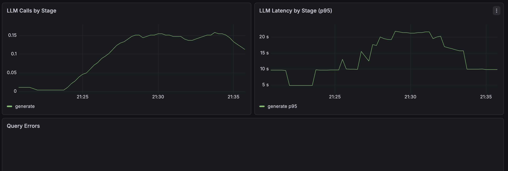
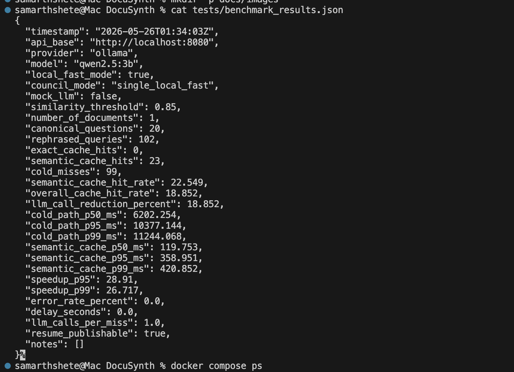
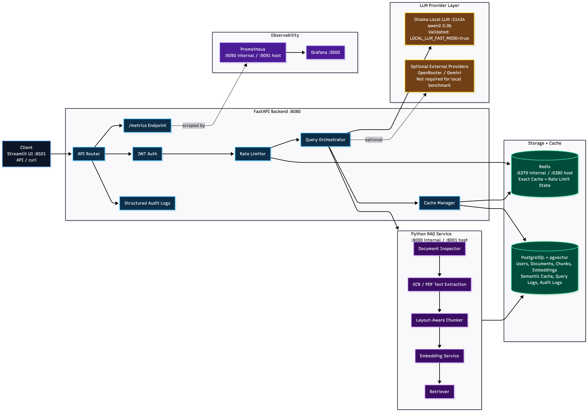

# DocuSynth — Dockerized RAG Document Intelligence Platform

[](https://github.com/samarthshete/DocuSynth/actions/workflows/ci.yml)

DocuSynth is a production-style, multi-service document intelligence system built for end-to-end Retrieval-Augmented Generation (RAG) workflows on local infrastructure. It ingests PDFs, retrieves semantically relevant context from PostgreSQL/pgvector, accelerates repeated queries with Redis exact caching plus semantic caching, generates answers with local Ollama models, and exposes deep observability through Prometheus and Grafana.

This repository demonstrates a practical, benchmarked RAG architecture suitable for real engineering portfolios: measurable latency improvements, explicit cache behavior, and reproducible containerized operations.

---

## Why DocuSynth

- **PDF ingestion pipeline** with metadata capture and chunked document storage
- **Semantic retrieval** backed by PostgreSQL + pgvector
- **Redis exact cache** for repeated identical questions
- **pgvector semantic cache** for paraphrased question reuse
- **Local LLM generation** via Ollama (`qwen2.5:3b`)
- **Prometheus + Grafana observability** for request, cache, retrieval, and LLM metrics
- **Benchmark harness** for cache-hit rate, latency distribution, and LLM-call reduction

---

## Stack (Validated)

- FastAPI backend: `http://localhost:8080`
- Python RAG service: `http://localhost:8001` (external), `http://python-rag:8000` (inside Docker)
- PostgreSQL + pgvector: `localhost:5433` (external), `postgres:5432` (inside Docker)
- Redis: `localhost:6380` (external), `redis:6379` (inside Docker)
- Prometheus: `http://localhost:9091` (external), `http://prometheus:9090` (inside Docker network)
- Grafana: `http://localhost:3000`
- Streamlit UI: `http://localhost:8501`
- Ollama local LLM: `http://localhost:11434` using `qwen2.5:3b`

Current benchmark mode:

- `LLM_PROVIDER=ollama`
- `LOCAL_LLM_FAST_MODE=true`
- `council_mode=single_local_fast`
- `mock_llm=false`
- `resume_publishable=true`

---

## Screenshots







---

## Architecture

DocuSynth runs as a 6-service Dockerized backend platform plus Streamlit UI:

1. `backend` (FastAPI control plane): auth, ingest proxy, query orchestration, cache decisions, metrics
2. `python-rag` (FastAPI RAG service): document chunking and retrieval APIs
3. `postgres` + pgvector: chunks, semantic cache, and operational records
4. `redis`: exact cache + rate limit state
5. `prometheus`: scrape + store metrics
6. `grafana`: observability dashboards
7. `streamlit`: chat-style user interface for demo interactions



---

## Request Lifecycle

On each `POST /api/v1/query`:

1. JWT auth + rate limit check
2. Redis exact cache lookup
3. Embedding + pgvector semantic cache lookup
4. Retrieval from RAG service on cache miss
5. LLM answer generation (Ollama local fast mode in current benchmark configuration)
6. Store cache artifacts and emit metrics


---

## Benchmark Results (Validated)

The following metrics are taken verbatim from the committed benchmark artifact
[`docs/benchmarks/benchmark_ollama_fast_final.json`](docs/benchmarks/benchmark_ollama_fast_final.json)
(single document, `single_local_fast` mode, `mock_llm=false`). Do not edit these by hand —
regenerate them from the JSON with `make benchmark` / `make clean-benchmark`.

- benchmark queries: **122 total**
- canonical questions: **20**
- rephrased queries: **102**
- semantic cache hits: **23**
- exact cache hits: **0**
- semantic cache hit rate: **22.549%**
- LLM-call reduction: **18.852%**
- cold path p50 / p95 / p99 latency: **6202.254 / 10377.144 / 11244.068 ms**
- semantic cache p50 / p95 / p99 latency: **119.753 / 358.951 / 420.852 ms**
- p95 / p99 speedup: **28.91x / 26.717x**
- error rate: **0.0%**
- provider: **Ollama**
- model: **qwen2.5:3b**
- local_fast_mode: **true**

> Note: an earlier revision of this README cited a 69.7x p95 speedup; that figure did not
> match the committed benchmark JSON and has been corrected to the measured **28.91x**.

---

## Quick Start

```bash
ollama pull qwen2.5:3b
make up
make health
make streamlit
```

### URLs

- Streamlit: [http://localhost:8501](http://localhost:8501)
- Backend health: [http://localhost:8080/health](http://localhost:8080/health)
- Python RAG health: [http://localhost:8001/health](http://localhost:8001/health)
- Prometheus: [http://localhost:9091](http://localhost:9091)
- Grafana: [http://localhost:3000](http://localhost:3000)

---

## Free Live Demo

You can deploy a free, lightweight Streamlit-only DocuSynth demo on Streamlit Community Cloud using `streamlit_cloud_app.py`.

- This free hosted demo is intentionally standalone and does **not** use Docker, FastAPI, Redis, Postgres, Prometheus, or Grafana.
- It supports PDF upload, text extraction (`pypdf`), chunking, and lightweight keyword retrieval.
- If `GEMINI_API_KEY` is configured (Streamlit secrets or environment variables), it can generate answers with Gemini.
- If `GEMINI_API_KEY` is missing, it still works in retrieval-only mode and clearly indicates that LLM answering is disabled.

Quick setup for Streamlit Community Cloud:

1. App file: `streamlit_cloud_app.py`
2. Requirements file: `requirements-streamlit-cloud.txt`
3. Optional secrets template: `.streamlit/secrets.toml.example`

The full DocuSynth platform remains the primary local Docker Compose architecture in this repository.

---

## API Usage Examples

### 1) Login

```bash
curl -s -X POST http://localhost:8080/api/v1/login \
  -H "Content-Type: application/json" \
  -d '{"username":"demo","password":"demo123"}'
```

### 2) Ingest PDF

```bash
TOKEN="<paste-jwt-token>"
curl -s -X POST http://localhost:8080/api/v1/ingest \
  -H "Authorization: Bearer ${TOKEN}" \
  -F "file=@tests/fixtures/sample.pdf"
```

### 3) Query Document

```bash
TOKEN="<paste-jwt-token>"
DOC_ID="<doc_id-from-ingest>"
curl -s -X POST http://localhost:8080/api/v1/query \
  -H "Authorization: Bearer ${TOKEN}" \
  -H "Content-Type: application/json" \
  -d "{\"doc_id\":\"${DOC_ID}\",\"question\":\"Summarize the key ideas\",\"top_k\":5}"
```

---

## Makefile Commands

| Command          | Description                                                                                 |
| ---------------- | ------------------------------------------------------------------------------------------- |
| `make up`        | Start core services (`postgres`, `redis`, `python-rag`, `backend`, `prometheus`, `grafana`) |
| `make down`      | Stop services and remove orphans                                                            |
| `make restart`   | Recreate core stack                                                                         |
| `make health`    | Run backend, RAG, and Prometheus health checks                                              |
| `make test`      | Run dockerized test suite                                                                   |
| `make smoke`     | Run Ollama smoke check                                                                      |
| `make benchmark` | Run benchmark harness and print summary                                                     |
| `make streamlit` | Launch Streamlit UI                                                                         |

---

## Observability

Prometheus scrapes backend `/metrics` and Grafana visualizes:

- query request rate
- end-to-end latency distributions
- cache path distribution (miss / semantic hit / exact hit)
- Redis lookup latency
- embedding latency
- pgvector lookup latency
- LLM call counts and per-query usage
- error counters by reason


---

## Project Structure

```text
DocuSynth/
├── backend/                   # FastAPI control plane
│   └── app/
├── services/
│   └── python-rag/            # FastAPI RAG service
├── streamlit/
│   └── app.py                 # Streamlit demo UI
├── monitoring/
│   ├── prometheus.yml
│   └── grafana/
├── scripts/
│   ├── smoke_ollama.py
│   └── smoke_openrouter.py
├── tests/
│   ├── bench_semantic_cache.py
│   └── benchmark_results.json
├── docs/
│   └── images/
├── docker-compose.yml
├── Makefile
└── README.md
```

---

## Troubleshooting

- Use **`http://localhost:9091`** in your browser for Prometheus UI.
- Use **`http://prometheus:9090`** only inside Grafana datasource config (container network).
- Do not run legacy WGAN benchmarking scripts for DocuSynth performance reporting.
- Use `tests/bench_semantic_cache.py` as the active benchmark harness.
- If long local benchmark runs fail with auth expiry, increase token TTL or add token refresh logic in your benchmark flow.

---

## Deployment Notes

- Detailed cloud deployment guide: [`docs/deployment.md`](docs/deployment.md)
- Local production-style Docker Compose deployment is fully supported and validated.
- For cloud deployment, replace local Ollama with hosted providers (Gemini/OpenRouter) **or** deploy Ollama on dedicated CPU/GPU infrastructure.
- Railway/Render can host API services, but you must provision managed Postgres/Redis, configure env vars securely, and wire a reachable LLM provider endpoint.
- This repository does **not** claim an already-live public deployment.

---

## Security Notes

- Never commit `.env` with secrets.
- Keep `.env.example` placeholders only.
- If any credential was ever exposed in git history or logs, rotate it immediately.

---

## Legacy Cleanup Note

DocuSynth supersedes the older CouncilAI branding/runtime; active implementation and docs now reflect the DocuSynth architecture and benchmark pipeline.

---

## Resume-Ready Summary

Built a 6-service Dockerized RAG platform with FastAPI, PostgreSQL/pgvector, Redis, Ollama, Prometheus, and Grafana; benchmarked 122 local LLM queries with 28.9x p95 semantic-cache speedup and 18.9% LLM-call reduction (0% errors).
