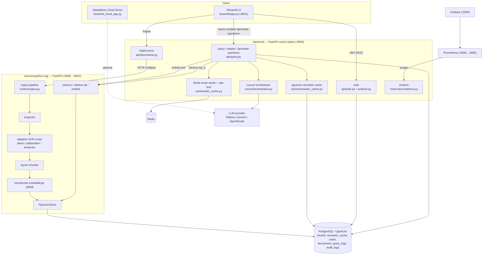
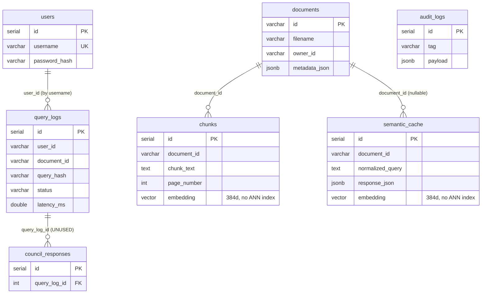
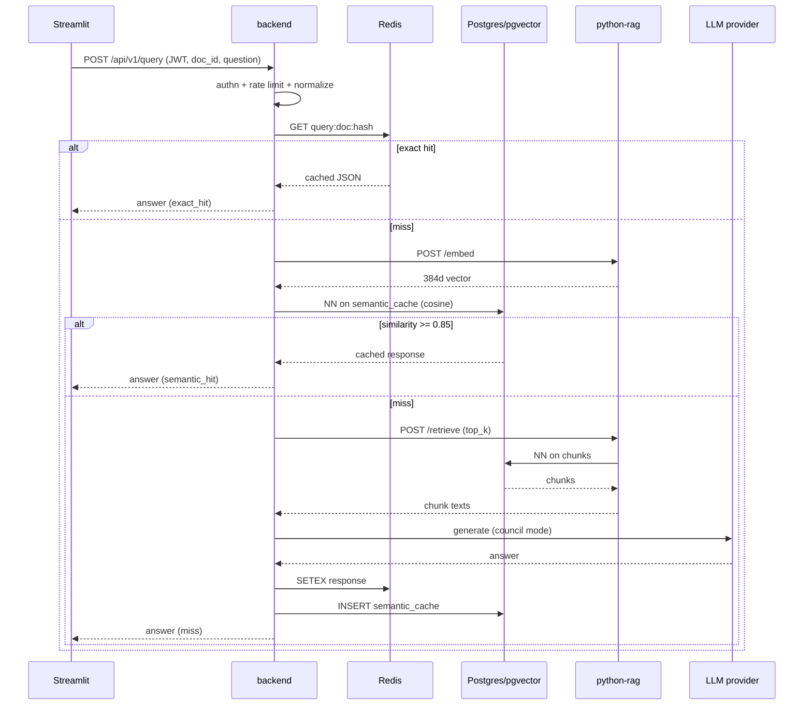

# DocuSynth — Architecture

> Evidence-based architecture reference. File paths are clickable in most editors. Compiled 2026-06-24.

## 1. System Overview

DocuSynth is a two-service FastAPI system sharing one PostgreSQL/pgvector database and one Redis instance, fronted by a Streamlit UI and observed by Prometheus + Grafana.

- **`backend/`** (control plane, `:8080`) — authentication, rate limiting, cache decisions, LLM "council" orchestration, metrics, audit. It does **not** embed or chunk; it calls the RAG service for that, but it **does** read/write the shared Postgres directly for users, documents, query logs, audit logs, and the semantic cache.
- **`services/python-rag/`** (RAG plane, `:8000`, mapped `:8001`) — document inspection, adaptive OCR, layout-aware chunking, embedding, and pgvector storage/retrieval.
- **Postgres + pgvector** — durable store for chunks, semantic cache, and operational tables.
- **Redis** — exact-match response cache + fixed-window rate-limit counters.
- **Prometheus/Grafana** — scrape `backend:8080/metrics`, visualize.
- **Ollama / Gemini / OpenRouter** — pluggable LLM providers.

An earlier **Go backend** (`services/go-backend/`) is archived (`ARCHIVED.md`) and not part of the runtime.

## 2. Architecture Diagram (Mermaid)

## 3. Request Lifecycle — `POST /api/v1/query`

Source: `backend/app/api/query.py`. Each numbered step is timed into a `timings` dict returned in the response.

1. **Middleware** (`main.py`) starts a latency timer; increments `docusynth_request_count_total`.
2. **Auth** — `get_current_user` decodes the JWT and loads the user.
3. **Rate limit** — `rate_limit_allow(username)`; 429 if exceeded (fixed window, see Failure Points).
4. **Validate** — empty question → 400.
5. **Normalize + key** — lowercase/whitespace-collapse, `sha256[:16]`, build `query:{doc_id|global}:{digest}`.
6. **L2 exact cache (Redis)** — `get_json`. Hit → return immediately, `cache_result="exact_hit"`, `llm_call_count=0`.
7. **Embed** — `embed_query` → HTTP `POST python-rag/embed` → 384-dim vector.
8. **L1 semantic cache (pgvector)** — `lookup_semantic`: nearest neighbor by cosine distance, filtered by `doc_id`; if similarity ≥ `SEMANTIC_CACHE_THRESHOLD` (0.85) → return, `cache_result="semantic_hit"`.
9. **Retrieve** — `retrieve_chunks` → HTTP `POST python-rag/retrieve` (top_k). Empty → 404; transport error → 503.
10. **Council** — `run_council(question, chunk_texts)` → LLM answer (mode depends on config). Error → 502.
11. **Persist + emit** — `set_json` (Redis, TTL 3600 s) + `store_semantic` (Postgres), Prometheus counters/histograms, `query_logs` row, audit log.
12. **Middleware** records overall latency + status.

Explain/generate-questions follow a similar shape but use `retrieve_all_chunks` and key the Redis cache on parameters; they do **not** use the semantic cache.

## 4. Data Flow

**Ingestion:** `Streamlit → backend /ingest → (md5 doc_id) → RAG /ingest → inspect → route OCR → chunk → embed (batch) → INSERT chunks(embedding) → backend INSERT documents row`.

**Query:** `Streamlit → backend /query → Redis GET → [miss] → RAG /embed → pgvector NN on semantic_cache → [miss] → RAG /retrieve (pgvector NN on chunks) → council → LLM → Redis SETEX + INSERT semantic_cache → response`.

**Observability:** counters/histograms updated inline; Prometheus scrapes `/metrics` every 15 s; Grafana reads Prometheus.

## 5. Service Boundaries

| Concern | Owner |
|---|---|
| AuthN/Z, sessions | backend |
| Rate limiting | backend (Redis) |
| Caching (exact + semantic) | backend |
| LLM provider integration & orchestration | backend (`council/`) |
| Document inspection, OCR, chunking | python-rag |
| Embedding generation | python-rag (backend calls it) |
| Vector storage & retrieval | python-rag (`PgVectorStore`) |
| Metrics exposition | backend only (RAG service is **not** scraped) |
| UI | Streamlit |

**Boundary smell:** the backend reads/writes the same `chunks`/Postgres database the RAG service owns, and both define ORM models + run `create_all`. The boundary is leaky.

## 6. Frontend / Backend Responsibility Split

- **Frontend (Streamlit):** holds JWT + `doc_id` + history in session state; renders chat/explain/questions; no business logic beyond light JSON parsing of question payloads.
- **Backend:** all auth, caching, orchestration, persistence, metrics. The Streamlit cloud demo is the exception — it embeds retrieval + LLM logic client-side because it has no backend.

## 7. Database Relationships

Relationships are **logical, not enforced**: only `council_responses.query_log_id` has a real FK; `chunks.document_id`, `query_logs.user_id`, etc. are plain columns with no FK constraints. `council_responses` has no writer in code.

## 8. Important Modules

**backend/**
- `app/main.py` — wiring, CORS, middleware, demo-user seed.
- `app/api/query.py` — the heart: cache cascade + orchestration + timings.
- `app/council/orchestrator.py` — mode selection (single_local_fast / single_response / peer_review_no_chairman / full_council).
- `app/council/llm_client.py` — provider abstraction (Ollama/Gemini/OpenRouter request+parse).
- `app/cache/redis_cache.py` — exact cache, key normalization, rate limit.
- `app/cache/semantic_cache.py` — pgvector cosine NN + threshold.
- `app/db/models.py` / `session.py` / `migrations_or_init.sql` — schema (3 sources).
- `app/metrics/prometheus.py` — all metrics (vars `councilai_*`, names `docusynth_*`).

**python-rag/**
- `app/routers/ingest.py` — orchestrates inspect→OCR→chunk→store.
- `app/ocr/router.py` — adaptive routing (`DirectTextExtractor` / `LayoutAwareOCR` / `TesseractOCR`).
- `app/chunking/layout_chunker.py` — table-preserving, heading-merging chunker.
- `app/embedding/transformer.py` — HF mean-pooled embeddings, class-cached.
- `app/retrieval/pgvector_store.py` — ingest/retrieve/retrieve_all.

**Likely-dead modules:** `backend/app/rag/chunker.py`, `ocr.py`, `parser.py` (not imported on the active path); `services/go-backend/**`.

## 9. Third-Party Integrations

- **LLM:** Ollama (OpenAI-compatible endpoint), Google Gemini (`generativelanguage` REST), OpenRouter (OpenAI-compatible).
- **Embeddings:** Hugging Face `transformers`/`torch` (CPU), default model `BAAI/bge-small-en-v1.5`.
- **OCR:** `pdfplumber`, `pytesseract` (+ system `tesseract-ocr`, `poppler-utils`), `pdf2image`, `PyPDF2`.
- **Infra images:** pgvector/pg16, redis:7-alpine, prometheus, grafana.

## 10. Deployment / Runtime Architecture

- **Local:** `docker-compose.yml` — six long-running services on a bridge network `docusynth-net`, healthchecks + `depends_on: service_healthy`, named volumes for pg/redis/prometheus/grafana. Postgres init SQL is bind-mounted. Streamlit launched separately (`make streamlit`). Ollama on host via `host.docker.internal`.
- **Cloud:** Railway/Render per `docs/deployment.md` — backend, python-rag, streamlit as Docker services + managed Postgres(pgvector)/Redis; Gemini mode. Validation via `scripts/validate_deployment.sh`.
- **Build:** backend image is slim+OCR system deps; RAG image installs CPU torch first for smaller/faster builds.

## 11. Failure Points & How to Improve Them

| # | Failure point | Evidence | Impact | Improvement |
|---|---|---|---|---|
| 1 | **Stale semantic cache** after document re-ingest | `semantic_cache.py` keys on (doc_id, query embedding), never on chunk content; `store_semantic` only inserts | Wrong/old answers served as "hits" | Invalidate cache rows on re-ingest; include a doc content-hash in the cache key/row |
| 2 | **Unbounded cache growth** | no TTL/eviction on `semantic_cache` | DB bloat, slower exact-scan NN | Add TTL/LRU eviction or periodic prune; cap rows per doc |
| 3 | **No ANN index** | init SQL/models create no IVFFlat/HNSW | O(n) vector scans | `CREATE INDEX … USING hnsw (embedding vector_cosine_ops)` on `chunks` + `semantic_cache` |
| 4 | **Rate limit semantics wrong** | `count <= rps*window` = 300/window (`redis_cache.py:65`) | Far weaker than implied "5 rps"; fails open on Redis error | Implement true token-bucket/sliding window; fail closed or alert on Redis error |
| 5 | **RAG service unauthenticated** | no auth in `services/python-rag` | Anyone with network access can ingest/retrieve | Network-isolate; add shared-secret/mTLS between backend and RAG |
| 6 | **CORS `*` + credentials** | both `main.py` | Browser CSRF/cred leakage if cookie auth added | Restrict origins; disable credentials or pin origins |
| 7 | **Single Postgres / no pooling tuning** | `session.py` | DB is a SPOF and bottleneck | Externalize, tune pool, add replicas/PgBouncer |
| 8 | **Council fan-out cost/latency** | `orchestrator.py` full_council = 3 generate + 3 review + 1 chairman | 7 LLM calls/query; partial failures common | Make council opt-in; cap members; circuit-break slow providers |
| 9 | **Schema defined 3 ways** | init SQL + 2 ORMs + `create_all` | Drift between code and DB | Adopt Alembic; single source of truth |
| 10 | **No metrics from RAG service** | `prometheus.yml` scrapes backend only | Blind to OCR/embed/ingest health | Add `/metrics` to RAG + scrape job |
| 11 | **LLM/embedding calls are blocking-ish & un-retried** | `httpx` per request, no retry/backoff | Transient provider errors surface as 502/503 | Add retries with jitter, timeouts already present; consider queue for ingest |

## 12. Sequence — happy-path query (Mermaid)

