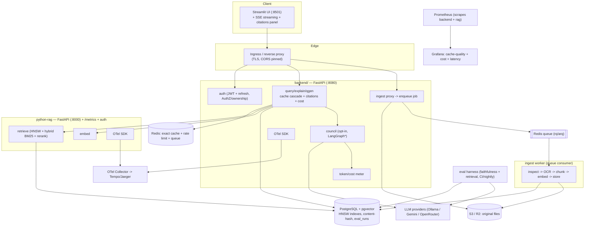

# DocuSynth — V2 Architecture Proposal

> A concrete target architecture that builds on what exists (it does not throw it away). Each addition is justified by a feature in `FEATURE_PRIORITIZATION.md`. Compiled 2026-06-24.

## 0. Design principles

1. **Keep the two-service split**, but harden the boundary (RAG service gets auth; backend stops reaching the DB for chunks where avoidable).
2. **Make the cache correct and measured** before scaling it.
3. **Move heavy/slow work (OCR, embedding) off the request path** via a queue.
4. **Instrument everything** (metrics + traces + cost).
5. **Add nothing that doesn't serve retrieval quality, correctness, observability, or reproducible deploy.**

## 1. V2 Architecture Diagram (Mermaid)

`*` LangGraph only if the council remains a featured mode (see `TECH_STACK_UPGRADE_ANALYSIS.md`).

## 2. Request lifecycle (V2 query)

1. Ingress terminates TLS, pins CORS, forwards to backend with a trace context.
2. Auth: verify JWT (+ `iss`/`aud`), load user; **enforce `owner_id` for the `doc_id`**.
3. Sliding-window rate limit (Redis Lua).
4. Redis exact cache → hit returns immediately (with citations from the cached payload).
5. Embed (HTTP to rag, traced span) → semantic cache lookup **filtered by `doc_id` AND `doc_content_hash`** → hit returns answer **+ citations**, recording a "cache_quality_sample" with probability *p* for the eval pipeline.
6. Miss → hybrid retrieve (BM25 + vector, HNSW, optional rerank) → council (opt-in mode) → LLM.
7. Capture token usage + cost per call; emit metrics; write `query_logs` (now incl. tokens/cost), `semantic_cache` (incl. content hash), audit.
8. Response includes `answer, citations[], cache_result, similarity, llm_call_count, tokens, cost_usd, timings, trace_id`.

## 3. Data flow (V2 ingest — async)

`UI → backend /ingest → store original to S3/R2 → enqueue {doc_id, object_key} → return 202 {job_id}`.
Worker: `dequeue → fetch from object store → inspect → OCR route → chunk → embed (batch) → INSERT chunks + doc_content_hash → invalidate stale semantic_cache rows for doc_id → mark job done`.
`UI polls GET /ingest/{job_id}` until ready.

## 4. Service boundaries (V2)

| Concern | Owner |
|---|---|
| AuthN/Z, ownership, rate limit | backend |
| Cache (exact + semantic + invalidation) | backend |
| Cost/token metering | backend |
| Council orchestration (opt-in) | backend (LangGraph optional) |
| Retrieval (hybrid + rerank), embedding | python-rag (authenticated) |
| OCR/chunk/embed/store (heavy) | ingest worker (queue consumer) |
| Original file storage | object store |
| Eval (faithfulness/retrieval) | offline harness (CI/nightly) |
| Metrics | backend + rag (both scraped) |
| Tracing | OTel collector |

The leak fixed: the backend no longer needs to define `chunks` ORM/`create_all`; chunk reads go through the rag API; the worker owns writes. Schema is owned by **Alembic** (single source).

## 5. Database / storage design (V2)

- **Postgres + pgvector** remains primary. Add: **HNSW** indexes on `chunks.embedding` and `semantic_cache.embedding`; a `tsvector` + GIN index on `chunks` for BM25; `documents.content_hash`; `semantic_cache.doc_content_hash`; `query_logs.{prompt_tokens, completion_tokens, cost_usd}`; new `ingest_jobs(job_id, doc_id, status, error, timestamps)` and optional `eval_runs(...)`.
- **Object store (S3/R2)** for original uploads (enables async ingest + re-ingest).
- **Redis** for exact cache, rate limit, **and the job queue**.
- Remove unused `council_responses` (or start writing to it).

## 6. Background job design

- **Queue:** Redis-backed (`rq` or `arq`). One **ingest worker** container.
- **Jobs:** `ingest_document`; scheduled `revalidate_cache_sample` and `nightly_eval`.
- **Semantics:** at-least-once with idempotent upserts keyed by `(doc_id, chunk_hash)`; failures retried with backoff; terminal failures surfaced via `ingest_jobs.status`.

## 7. AI / agent workflow design

- **Default path:** single-model (Ollama local or Gemini cloud) — fast, cheap, benchmarked.
- **Optional council:** if kept, a LangGraph `StateGraph` with nodes `generate → review → chairman`, conditional edges for the four existing modes, per-node timeout + circuit-breaker, fallback edge to "best candidate." Nodes wrap today's `generator/reviewer/synthesizer` functions.
- **Retrieval:** hybrid (BM25 ⊕ vector via reciprocal rank fusion) → optional cross-encoder rerank → top-k to the LLM.
- **Eval loop:** offline harness scores cache-hit faithfulness vs cold answers; drifted entries auto-evicted; threshold (0.85) tuned from the sweep.

## 8. Observability design

- **Metrics (Prometheus):** existing `docusynth_*` + new `docusynth_llm_tokens_total{stage,type}`, `docusynth_query_cost_usd`, `docusynth_cost_saved_usd_total`, `docusynth_cache_faithfulness` (from eval); **scrape the rag service too**.
- **Tracing (OTel):** spans `query → embed → semantic_lookup → retrieve → council → llm`, propagated across the backend→rag hop; export to Tempo/Jaeger.
- **Dashboards (Grafana):** cache hit-rate, p95 by `cache_result`, tokens/query, $ saved by cache, retrieval latency vs corpus size, faithfulness retention.
- **Logs:** keep tagged JSON (`audit/logger.py`); add `trace_id`/request-id correlation.

## 9. Deployment design

- **Local:** Docker Compose (as today) + worker + OTel collector.
- **Cloud:** **Terraform** provisions managed Postgres(pgvector) + Redis + object store + the three services + worker on a container platform (ECS/Fargate or Railway/Render). Secrets via the platform's secret manager. **CI/CD (GitHub Actions)** builds/tests/lints, then `terraform plan/apply` on protected branches.
- **EKS** only later, if a deliberate Kubernetes/HPA production story is wanted (Phase 4).

## 10. Security design

- Pin **CORS** to known origins; drop `allow_credentials` with `*`.
- **AuthZ**: enforce `documents.owner_id` on every query/ingest/retrieve path.
- **Authenticate the rag service** (shared secret/mTLS) and keep it network-private.
- JWT: verify `iss`/`aud`, add refresh + revocation, gate `/register`, disable the `demo` seed outside dev.
- Fix rate limiting (sliding window; explicit fail policy).
- Secrets only via env/secret manager; rotate the keys currently in the working-tree `.env`.

## 11. Failure handling

- LLM/embedding/retrieve calls: timeouts (exist) **+ retries with jitter + circuit breaker**; council degrades to single-model on provider failure.
- Cache: Redis outage → fail **closed** on rate limit (or alert), continue serving (cache optional); Postgres outage → 503 with clear error.
- Ingest: queue + retries; partial OCR failure recorded per-page; job marked failed with reason.
- Tracing/metrics export failures must never break request handling (async, best-effort).

## 12. Scaling plan

- Stateless backend/rag/worker scale horizontally behind the ingress.
- Postgres: HNSW for vector scale; PgBouncer; read replicas if read-bound; externalized managed instance.
- Redis: managed, with eviction policy for cache; separate logical DBs for cache/queue/rate-limit.
- Object store scales independently.
- First real bottleneck addressed: the missing ANN index (HNSW).

---

## 13. Current vs MVP vs Production-grade

| Dimension | **Current (as-is)** | **MVP (correct + credible)** | **Production-grade** |
|---|---|---|---|
| Cache | exact + semantic, no invalidation, no eviction | + content-hash invalidation, + faithfulness eval | + auto-revalidation, eviction, tuned threshold |
| Retrieval | cosine top-k, no ANN index | + HNSW index | + hybrid BM25 + rerank, measured nDCG |
| Trust | answers without citations | + citations/pages in response | + groundedness gating |
| Ingest | synchronous, in-memory, discarded | same + content hash | async queue + object store + retries |
| Auth | JWT, no ownership, RAG open, CORS `*` | + ownership, RAG auth, CORS pinned | + refresh/revoke, role-gated admin |
| Observability | metrics (backend only) | + RAG scraped, + cost/token | + OTel tracing, alerts, dashboards |
| Cost | untracked | per-query tokens + USD | $ saved-by-cache dashboard + budgets |
| CI/CD | none | GitHub Actions (lint/type/test/smoke) | + image publish + terraform apply |
| Schema | 3-way create_all | Alembic single source | migrations gated in CI |
| Deploy | Compose; cloud unverified | Compose + one verified cloud deploy | Terraform IaC (+ EKS optional) |
| Repo | `.venv311` committed, dead Go code | cleaned, lint-gated | enforced by CI |

**Reading guide:** the **MVP** column is the target of Roadmap Phases 1–2 (`ROADMAP.md`); the **Production-grade** column is Phases 3–4. Do not skip to production-grade infra (EKS/Lambda/LangGraph) before the MVP column is fully green — that's the line between "impressive" and "forced."
